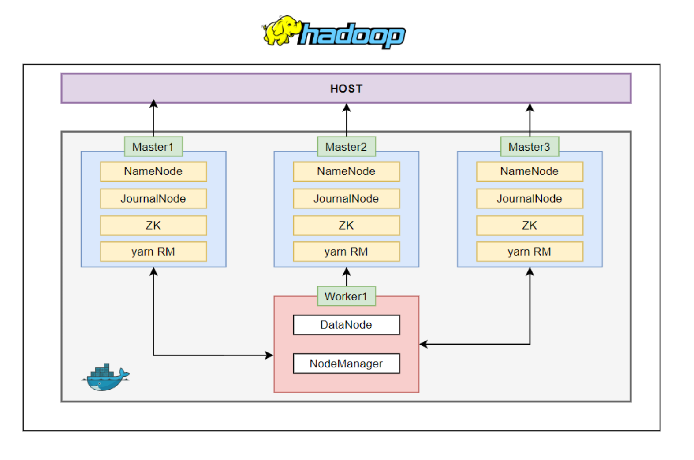

# Hadoop Cluster with High Availability (HA)

A Dockerized Hadoop cluster with High Availability (HA) configuration, featuring multiple master nodes (NameNode, ResourceManager, JournalNode) and worker nodes (DataNode, NodeManager) with ZooKeeper for failover management.

## Features

- **High Availability NameNode**: 3-node HA setup with automatic failover
- **ResourceManager HA**: YARN ResourceManager with 3 active/standby nodes
- **JournalNodes**: For shared edits between NameNodes
- **ZooKeeper Ensemble**: For coordination and failover management
- **Persistent Storage**: Using Docker volumes for HDFS data
- **Health Checks**: Built-in container health monitoring

## Cluster Architecture

### Master Nodes (3)
- NameNode (HA)
- JournalNode
- ZooKeeper
- ResourceManager (HA YARN)

### Worker Nodes
- DataNode
- NodeManager (YARN)

## Configuration Files

- `core-site.xml`: Core Hadoop configuration
    - Set default FS to HA cluster: hdfs://mycluster
- `hdfs-site.xml`: HDFS configuration with HA settings
    - Configured 3-node HA for NameNodes (nn1, nn2, nn3)
    - JournalNodes for shared edits (qjournal://Master1:8485;Master2:8485 Master3:8485)
    - Automatic failover enabled with ZooKeeper
    - Fencing method configured with SSH
    - Data and name directories set up
- `yarn-site.xml`: YARN and ResourceManager HA configuration
    - Configured 3-node ResourceManager HA (rm1, rm2, rm3)
    - MapReduce shuffle service enabled
    - ZooKeeper addresses for RM state store
- `mapred-site.xml`: MapReduce configuration
    - Configured MapReduce environment variables
    - Set paths for MapReduce components
- `zoo.cfg`: ZooKeeper ensemble configuration
    - Configured 3-node ZooKeeper ensemble
    - Tick time, init limit, sync limit settings
    - Server addresses with election ports
- `entrypoint.sh`: Startup script for container initialization

## Documentation References
- [HDFS High Availability with QJM](https://hadoop.apache.org/docs/stable/hadoop-project-dist/hadoop-hdfs/HDFSHighAvailabilityWithQJM.html#Deployment)
- [ResourceManager High Availability](https://hadoop.apache.org/docs/stable/hadoop-yarn/hadoop-yarn-site/ResourceManagerHA.html)

## Prerequisites

- Docker
- Docker Compose
- At least 8GB RAM recommended

## Getting Started

1. **Clone the repository**:
   ```bash
   git clone https://github.com/MuhamedHekal/Hadoop-Cluster-with-High-Availability-HA.git
   
   cd Hadoop-Cluster-with-High-Availability-HA
   ```

2.  **Build and start the cluster**:
    ```bash
    docker-compose up -d
    ```

3. **Access the Web UIs**:

- NameNode:
    - **Master1:** [http://localhost:9871](http://localhost:9871)
    - **Master2:** [http://localhost:9872](http://localhost:9872)
    - **Master3:** [http://localhost:9873](http://localhost:9873)

- ResourceManager:
    - **Master1:** [http://localhost:8088](http://localhost:8088)
    - **Master2:** [http://localhost:8089](http://localhost:8089)
    - **Master3:** [http://localhost:8090](http://localhost:8090)


## Port Mappings

| Service            | Master1 | Master2 | Master3 |
|--------------------|---------|---------|---------|
| **NameNode HTTP**  |  9871   |  9872   |  9873   |
| **ResourceManager** |  8088   |  8089   |  8090   |


## Cluster Management Commands

### Check Service States

#### Check HDFS HA status:
```bash
hdfs haadmin -getAllServiceState
```

#### Check YARN RM status:
```bash
yarn rmadmin -getAllServiceState
```

---

### Test the Cluster

#### 1. Verify HDFS:
```bash
hdfs dfs -mkdir /test
hdfs dfs -put <localfile> /test
hdfs dfs -ls /test
```

#### 2. Run a MapReduce job:
```bash
hadoop jar $HADOOP_HOME/share/hadoop/mapreduce/hadoop-mapreduce-examples-*.jar pi 16 1000
```

#### 3. Check YARN applications:
```bash
yarn application -list
```

## Environment Variables

- **MYID**: ZooKeeper node ID (1, 2, or 3 for masters)
- **ROLE**: `master` or `worker` node type


## Add Additional Worker Nodes
```
docker container run -it --name worker2 -h worker2 --network hadoop-cluster_default -e ROLE=worker -v Worker2-datanode:/home/hadoop/hadoopdata/hdfs/datanode hadoop-cluster-worker1
```

## Volumes

The cluster uses Docker volumes to persist:

- NameNode data
- JournalNode data
- ZooKeeper data
- DataNode data

---

## Health Checks

Each container has health checks to verify critical services are running:

- **Masters**: Checks for NameNode and ResourceManager processes
- **Workers**: Verifies DataNode directory exists


